# Writeup HTB Starting Point
**Môn**: An toàn mạng - NT140.Q21.ANTN<br>
**Lớp**: ATTN2024<br>
**Sinh viên thực hiện**: Nguyễn Minh Phúc Khang - 24520758<br>

--- 

## Meow (Linux)
### Task 1: What does the acronym VM stand for?
> Virtual Machine

### Task 2: What tool do we use to interact with the operating system in order to issue commands via the command line, such as the one to start our VPN connection? It's also known as a console or shell.
> Terminal 

### Task 3: What service do we use to form our VPN connection into HTB labs?
> openvpn

### Task 4: What tool do we use to test our connection to the target with an ICMP echo request?
> ping 


### Task 5: What is the name of the most common tool for finding open ports on a target?
> nmap

### Task 6: What service do we identify on port 23/tcp during our scans?
> telnet

### Task 7: What username is able to log into the target over telnet with a blank password?
Tiến hành kết nối telnet tới địa chỉ IP của máy:
```bash
telnet 10.129.133.134
```
Trong đó: `10.129.133.134` là địa chỉ IP của target.

Khi được yêu cầu nhập username, néu ta nhập là `root` thì ta sẽ nhảy thẳng vào shell mà không cần nhập password.

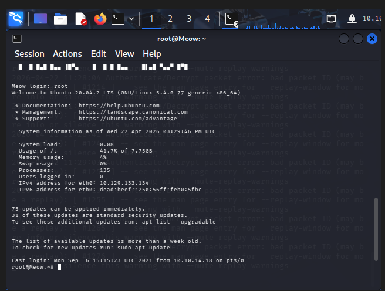

### Get Flag
Sau khi đã vào được shell, tiến hành kiểm tra bằng lệnh `ls` và phát hiện `flag.txt`:

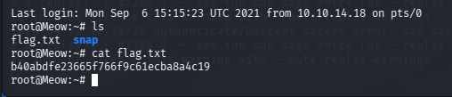

> Flag: `b40abdfe23665f766f9c61ecba8a4c19`


---

## Pawn (Linux)
### Task 1: What does the 3-letter acronym FTP stand for?
> File Transfer Protocol

### Task 2: Which port does the FTP service listen on usually?
> 21

### Task 3: FTP sends data in the clear, without any encryption. What acronym is used for a later protocol designed to provide similar functionality to FTP but securely, as an extension of the SSH protocol?
> SFTP (SSH File Transfer Protocol)

### Task 4: What is the command we can use to send an ICMP echo request to test our connection to the target?
> ping 

### Task 5: From your scans, what version is FTP running on the target?
Quét target bằng lệnh:
```bash
nmap -sC -sV 10.129.133.143
```
Trong đó:
- `-sC`: Sử dụng script mặc định của nmap.
- `-sV`: Xác định phiên bản của các dịch vụ đang hoạt động trên cổng, giúp nhận diện chính xác các loại dịch vụ.
- `10.129.133.143`: Địa chỉ IP của target.

Kết quả cho thấy dịch vụ FTP đang chạy trên target có version `vsftpd 3.0.3`.

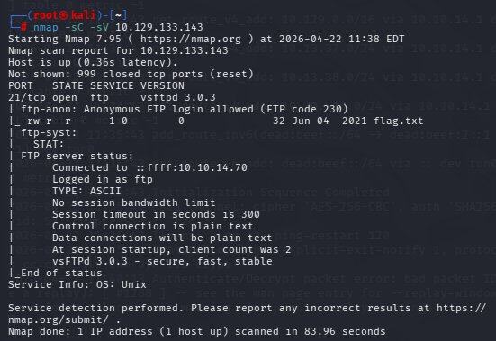

### Task 6: From your scans, what OS type is running on the target?
Dựa trên kết quả của **Task 5**, có thể xác định được target đang chạy hệ điều hành `Unix`.

### Task 7: What is the command we need to run in order to display the 'ftp' client help menu?
> ftp -?

### Task 8: What is username that is used over FTP when you want to log in without having an account?
> Anonymous

### Task 9: What is the response code we get for the FTP message 'Login successful'?
Khi kết nối `FTP` tới target bằng username `anonymous`, mã trả về `230` báo hiệu đăng nhập thành công.

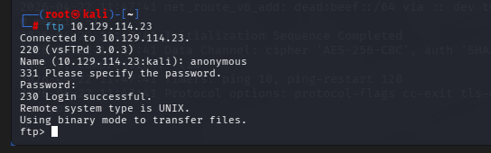

### Task 10: There are a couple of commands we can use to list the files and directories available on the FTP server. One is dir. What is the other that is a common way to list files on a Linux system.
> ls

### Task 10: What is the command used to download the file we found on the FTP server?
> get

### Get Flag
Sau khi thực hiện kết nối **FTP** thành công, khi kiểm tra bằng lệnh `ls`, ta phát hiện tồn tại file `flag.txt`.

Tiến hành dùng lệnh `get` để tải file đó về máy:

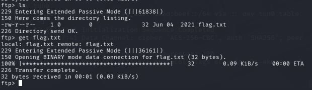

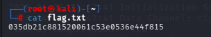

> Flag: `035db21c881520061c53e0536e44f815`


---

## Dancing (Windows)
### Task 1: What does the 3-letter acronym SMB stand for?
> Server Message Block

### Task 2: What port does SMB use to operate at?
> 445 

### Task 3: What is the service name for port 445 that came up in our Nmap scan?
Quét target bằng lệnh:
```bash
nmap -sC -sV 10.129.133.164
```
Trong đó:
- `-sC`: Sử dụng script mặc định của nmap.
- `-sV`: Xác định phiên bản của các dịch vụ đang hoạt động trên cổng, giúp nhận diện chính xác các loại dịch vụ.
- `10.129.133.164`: Địa chỉ IP của target.

Kết quả cho thấy tên của dịch vụ tại port **445** là `microsoft-ds`. 

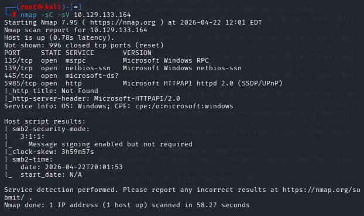

### Task 4: What is the 'flag' or 'switch' that we can use with the smbclient utility to 'list' the available SMB shares on Dancing?
> -L

### Task 5: How many shares are there on Dancing?
Sử dụng công cụ `smbclient` với cờ `-L` để liệt kê các SMB shares có sẵn trên target
```bash
smbclient -L 10.129.133.164
```

Kết quả cho thấy số SMB shares được chia sẻ là `4`.

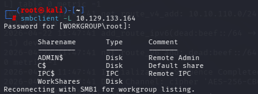

### Task 6: What is the name of the share we are able to access in the end with a blank password?
Kết quả tại **Task 5** cho thấy folder `Workshares` được share với quyền thường (không phải quyền admin nên không cần password).

### Task 7: What is the command we can use within the SMB shell to download the files we find?
> get

### Get FLag 
Tiến hành kết nối tới SMB share **WorkShares** trên máy target với quyền anonymous:
```bash
smbclient //10.129.133.164/WorkShares -N
```

Sau khi truy cập vào được folder **WorkShares**, ta phát hiện có 2 folder là `Amy.J` và `James.P`. Khi truy cập vào từng thư mục, phát hiện trong `James.P` tồn tại file tên là `flag.txt`.

Tiến hành lấy file này về bằng lệnh `get`:

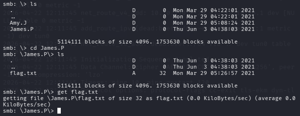

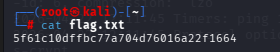

> Flag: `5f61c10dffbc77a704d76016a22f1664`


---

## Redeemer (Linux)
### Task 1: Which TCP port is open on the machine?
Do port TCP của target không nằm trong 1000 port phố biển.

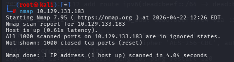

Ta tiến hành quét full port của target bằng lệnh:
```bash
nmap -p- -sV 10.129.133.183
```
Trong đó:
- `-p-`: Quét tất cả các port.
- `-sV`: Xác định phiên bản của các dịch vụ đang hoạt động trên cổng, giúp nhận diện chính xác các loại dịch vụ.
- `10.129.133.183`: Địa chỉ IP của target. 

Kết quả cho thấy dịch vụ TCP đang chạy tại cổng `6379`. 

### Task 2: Which service is running on the port that is open on the machine?
Dựa vào kết quả của Task 1, có thể thấy dịch vụ đăng chạy trên port `6379` là `redis`.

### Task 3: What type of database is Redis? Choose from the following options: (i) In-memory Database, (ii) Traditional Database
> In-memory Database

### Task 4: Which command-line utility is used to interact with the Redis server? Enter the program name you would enter into the terminal without any arguments.
> redis-cli

### Task 5: Which flag is used with the Redis command-line utility to specify the hostname?
> -H 

### Task 6: Once connected to a Redis server, which command is used to obtain the information and statistics about the Redis server?
> info

### Task 7: What is the version of the Redis server being used on the target machine?
Khi truy cập vào vào **redis** và chạy lệnh `info`, ta thấy redis server có version `5.0.7`.

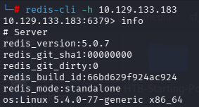

### Task 8: Which command is used to select the desired database in Redis?
> select 

### Task 9: How many keys are present inside the database with index 0?
Sử dụng lệnh `select 0` dể chọn database số 0. Sau đó liệt kê tất cả các key bằng lệnh `keys *`.

Kết quả cho thấy có `4` key trong database 0.

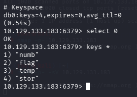

### Task 10: Which command is used to obtain all the keys in a database?
> key *

### Get Flag
**Task 9** cho ta thấy được trong database 0 có một key tên là `flag`. Tiến hành xem nội dung bên trong key đó bằng lệnh `get flag`.

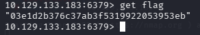

> Flag: `03e1d2b376c37ab3f5319922053953eb`

